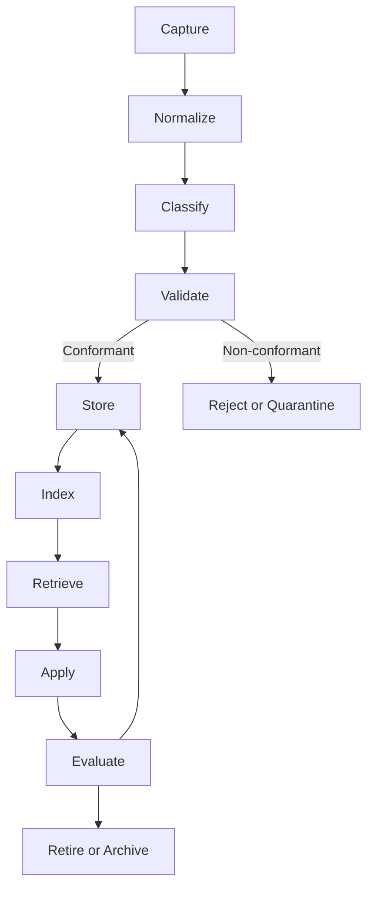
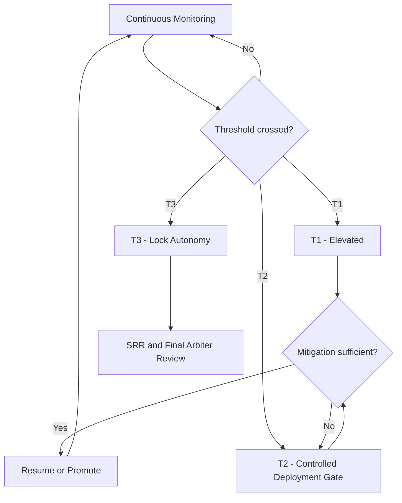
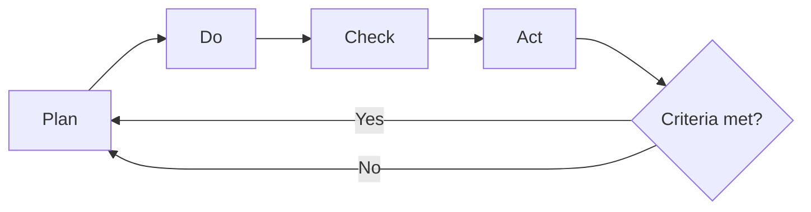
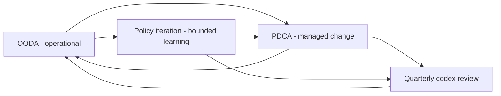

<!-- managed-by: activ8-ai-context-pack | pack-version: 1.2.0 -->
<!-- source-sha: a0d4785 -->
<!-- gov-lint-ignore -->
# MAOS Governance Codex - Flow Diagrams

**Version:** `1.0`  
**Status:** ACTIVE  
**Related White Paper:** `docs/MAOS-GOVERNANCE-CODEX-WHITE-PAPER-v1.md`

---

## 1. Five-Plane Architecture

```mermaid
flowchart LR
  subgraph C[CONTROL PLANE]
    P[Policies and Thresholds]
    A[Authority Model]
    R[Risk Register]
  end

  subgraph S[SAFETY AND GUARDRAILS]
    G1[Access Control]
    G2[Real-Time Classifiers]
    G3[Async Monitoring]
    G4[Lock Autonomy and SRR]
  end

  subgraph E[EXECUTION PLANE]
    O[Orchestrator]
    AG[Agents]
    T[Tools and Workflows]
  end

  subgraph D[DATA PLANE]
    TEL[Telemetry]
    PROV[Provenance]
    EVAL[Evaluations]
    INC[Incident Pipeline]
  end

  subgraph L[LEARNING PLANE]
    EP[Episodic Memory]
    SEM[Semantic Memory]
    PROC[Procedural Memory]
    NORM[Normative Memory]
  end

  C --> S
  C --> E
  E --> D
  D --> L
  L --> E
  D --> C
  S --> E
```

---

## 2. Knowledge Lifecycle

---

## 3. Capability Threshold Escalation

---

## 4. PDCA Governance Cycle

---

## 5. Governance Rhythm Integration

---

© 2026 Activ8 Automation Intelligence, LLC · All Rights Reserved · Build Document - Confidential & Internal
