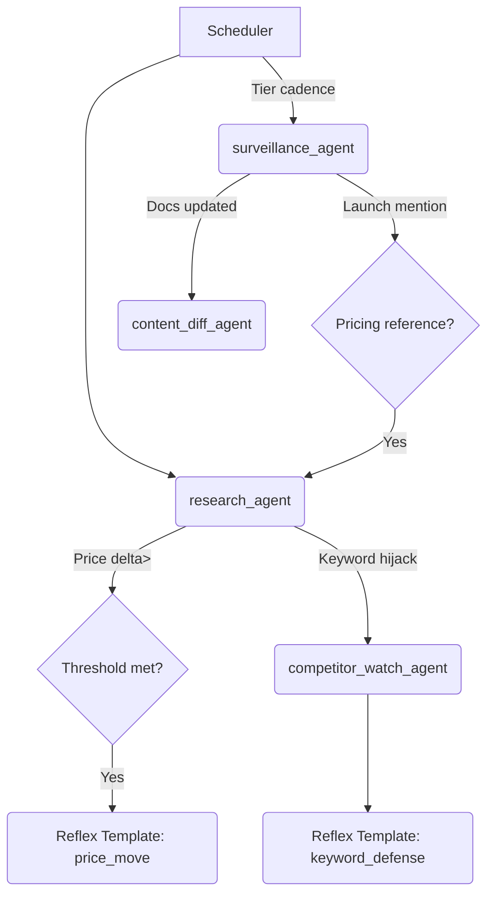

# Agent Hub – Web Analysis Stack

This hub governs how MAOS assigns, orchestrates, and audits the web-analysis agents powering the Competitive Intelligence Engine (v1).

## Global Contract
- **Input Envelope**  
  ```json
  {
    "client_id": "cli_x",
    "competitor_id": "comp_y",
    "priority_tier": "Tier 0",
    "tracking_surfaces": {...},
    "alert_thresholds": {...},
    "context_hash": "hash_from_definition_map"
  }
  ```
  Derived from the Competitor Definition Map; immutable for the run.

- **Output Payload (CIE v1)**  
  ```json
  {
    "event_id": "cie_2025-00123",
    "agent": "surveillance_agent",
    "client_id": "cli_x",
    "competitor_id": "comp_y",
    "channel": "pricing",
    "detected_change": {...},
    "raw_artifacts": ["s3://intel/..."],
    "confidence": 0.78,
    "recommended_action_stub": "Evaluate counter-pricing for SKU Alpha",
    "custodian_hash": null
  }
  ```
  Comparator later appends `impact_scores`, `market_notes`, and final `custodian_hash`.

- **Confidence Rules**  
  - Base scorer per agent (source reliability × extraction quality).  
  - Down-weighted for stale surfaces (>7 days).  
  - Up-weighted when multiple agents corroborate same delta.

## Agent Directory
| Agent | Role | Primary Triggers | Detection Focus | Escalation |
| --- | --- | --- | --- | --- |
| `surveillance_agent` | Always-on watcher for PR, blogs, launch feeds. | RSS/webhook updates, hourly poll fallback. | New product launches, roadmap teasers, partnerships. | Escalate to `research_agent` when launch references pricing or SKU change. |
| `research_agent` | Structured data extraction + enrichment. | Scheduled (hourly for pricing), manual ad-hoc. | Pricing tables, packaging shifts, SERP position snapshots. | If impact High, auto-request custodian pre-review before Reflex. |
| `competitor_watch_agent` | Ad library + campaign tracker. | Twice daily baseline, instant on webhook. | Paid social/search creatives, spend tiers, targeting hints. | If creative targets client keywords, trigger Reflex template `keyword_defense`. |
| `web_crawler_agent` | Deep crawl of product/docs. | 3× daily, on-demand for Tier 0. | Feature docs, help centers, SaaS UI diffs. | When diff magnitude > threshold, queue `content_diff_agent`. |
| `signal_harvester_agent` | Social + sentiment ingestion. | Streaming API + hourly summarizer. | Velocity spikes, sentiment shifts, influencer amplification. | Negative sentiment spike >30% triggers `strategy_sprint` notice. |
| `content_diff_agent` | Compares versions of captured assets. | Triggered by crawler/surveillance. | Pinpointing textual/structural diffs, classifying change type. | High severity diffs auto-tag Custodian for validation. |

## Assignment Logic
1. **Scheduler Matrix**  
   - Tier 0 clients: every agent runs at highest cadence.  
   - Tier 1: standard cadence; Tier 2: once daily but can be promoted by manual trigger.
2. **Event-based Triggers**  
   - Webhooks (RSS, social, ad libraries) call `surveillance_agent` or `signal_harvester_agent`.  
   - Diff magnitude from `web_crawler_agent` determines if `content_diff_agent` spins up.  
   - Pricing anomalies > configured threshold auto-run `research_agent` deep dive.
3. **Manual Overrides**  
   - Custodians can enqueue forced sweeps via Agent Hub command with context + SLA.

## Output Contracts
- Every agent response must include: `event_id`, `client_id`, `competitor_id`, `channel`, `timestamp`, `confidence`, `raw_artifacts`, `recommended_action_stub`.  
- Evidence storage uses `evidence://` URIs pointing to encrypted S3 or Notion attachments.  
- Agents append `governance_flags`: `[requires_review, escalation, data_gap]`.

## Confidence Scoring
| Factor | Weight |
| --- | --- |
| Source reliability (verified feed vs scraped) | 0.35 |
| Extraction fidelity (parser success, checksum match) | 0.25 |
| Recency (minutes since capture) | 0.15 |
| corroboration count | 0.15 |
| Historical accuracy of agent for this channel | 0.10 |

Scores <0.4 auto-flag as `data_gap` for follow-up.

## Governance Hooks
- **Custodian Hashing**: After comparator validation, each event receives SHA-256 hash over `event_id + client_id + competitor_id + evidence_refs + recommended_action_stub`.  
- **Review Routing**: `governance_route` table supplies custodian + SLA; Agent Hub enriches payload before Reflex dispatch.  
- **Audit Trail**: Every run logs to `codex://governance/agent-runs/{event_id}` with parameters, runtime, and result.

## Trigger Logic (Pseudo)


## Output Routing
1. Agents emit to `external_intel.events`.  
2. Comparator scores + packages into `competitor_delta`.  
3. Reflex consumes + creates Teamwork tasks.  
4. Same payload flows to Client Portal + Codex.

## SLA & Monitoring
- Each agent exposes heartbeat metric (`runs_success`, `runs_failed`, `latency_ms`).  
- Reflex monitors for missed cadences and pings Custodian when two misses occur inside 24 hours.  
- Incident runbook stored in Codex for rapid recovery.

This Agent Hub definition ensures every web-analysis agent operates with explicit triggers, contracts, confidence policies, and governance tie-ins demanded by the Charter.
