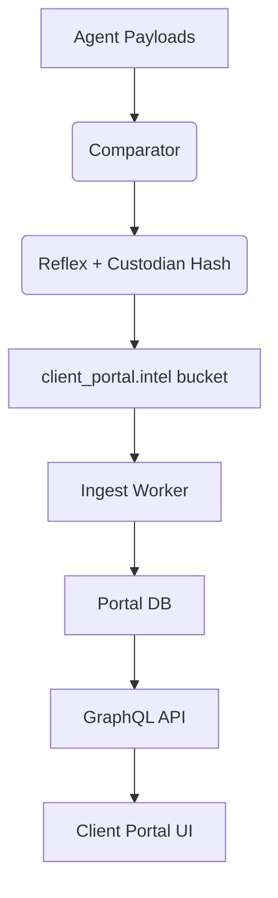

# Client Portal Integration – Competitor Intelligence Engine

## Objective
Expose external competitive signals inside the Client Portal so every client squad and executive gains real-time visibility into threats, opportunities, risks, and revenue implications with Charter-grade context.

## Data Flow
1. **Reflex Output** – Every qualified competitor delta serialized as `competitor_delta_v1`.  
2. **Portal Ingest Worker** – Polls `client_portal.intel` bucket every 5 minutes, validates Custodian hash, and upserts into Portal DB.  
3. **Portal API** – GraphQL surfaces typed queries for tabs/widgets (cached 60 seconds).  
4. **UI Components** – Competitor Intelligence tab, Industry Radar, Trend Watch, Risk alerts, Revenue Impact module.

## Data Models
### `competitor_delta`
| Field | Description |
| --- | --- |
| `delta_id` | Unique ID (matches Reflex event). |
| `client_id` | Portal tenant key. |
| `competitor_id` | For cross-referencing with Definition Map. |
| `delta_type` | Price, SKU, Campaign, Sentiment, Feature, Keyword. |
| `threat_score` / `opportunity_score` | 0-1 floats. |
| `urgency_hours` | Derived from SLA. |
| `confidence` | Carried from Agent Hub. |
| `summary`, `market_impact`, `strategic_implication`, `recommended_actions`, `governance_notes` | Charter brief sections. |
| `task_id` | Teamwork reference. |
| `custodian_hash` | For governance validation. |
| `evidence_refs` | URI list. |

### `industry_radar_snapshot`
Aggregated view per client, 30/90-day lookback.
| Field | Description |
| --- | --- |
| `client_id` |  |
| `timeframe_days` | 30 or 90. |
| `channel_breakdown` | JSON counts + weighted scores per channel. |
| `risk_level` | Enum (Green, Yellow, Red). |
| `opportunity_index` | Derived from opportunity score averages. |

### `trend_watch_entry`
| Field | Description |
| --- | --- |
| `client_id` |  |
| `theme` | Pricing, Positioning, Product, Campaigns, Sentiment, Algorithms, Market. |
| `narrative` | ≤600 chars. |
| `confidence` | Weighted average. |
| `last_updated` | Timestamp. |

## UI Surfaces
- **Competitor Intelligence Tab**  
  - Table of open deltas with severity color, SLA countdown, and action buttons (view task, acknowledge).  
  - Detail drawer showing Charter brief + evidence attachments.
- **Industry Radar**  
  - Heatmap plotting competitor initiatives vs channel + time.  
  - Hover reveals event counts and top deltas per quadrant.
- **Trend Watch**  
  - Storyline cards updated every 12h summarizing macro patterns.  
  - “Adopt Playbook” CTA linking to Action Matrix.
- **Risk Alerts**  
  - Portal-wide banner when risk level = Red.  
  - Yellow alerts limited to client dashboard.
- **Revenue Impact Model**  
  - Inline calculator showing estimated revenue at risk/opportunity using KPI coefficients from Definition Map.  
  - States: Baseline, Best-case Response, No Response.

## Alert Logic
| Condition | Alert |
| --- | --- |
| `threat_score ≥ 0.8` AND task overdue | Red alert with paging. |
| `opportunity_score ≥ 0.7` AND no task yet | Yellow alert prompting action. |
| `sentiment_risk` delta with velocity >40% | Immediate Red alert + Comms escalation. |
| ≥3 high-impact deltas in 7 days | Trigger Strategy Sprint recommendation banner. |

## Governance & Security
- Validate Custodian hash before writing to Portal DB. Reject mismatches and escalate.  
- Store evidence references as signed URLs; UI fetches via proxy to prevent direct exposure.  
- Portal audit log records when users view/acknowledge deltas.  
- Access control: only client team members scoped to the Portal tenant can view; Codex readouts remain internal.

## Implementation Steps
1. **Schema Update** – Add new tables/fields to Portal DB (migration script).  
2. **Ingest Worker** – Extend existing worker or deploy new service to process `competitor_delta_v1`.  
3. **API Layer** – Define GraphQL types (`CompetitorDelta`, `IndustryRadarSnapshot`, `TrendWatchEntry`, `RevenueImpact`).  
4. **UI Components** – Build React/Vue components per surface, leveraging design tokens.  
5. **Alert System** – Connect to existing Portal notification bus; ensure red alerts also ping Heartbeats.  
6. **Testing** – Snapshot GraphQL responses, UI storybook states (Green/Yellow/Red), integration tests verifying ingest → UI pipeline.  
7. **Rollout** – Pilot with Tier 0 clients, gather feedback, then enable for all.

## Success Metrics
- Portal adoption: ≥80% of Tier 0 client users view Competitor Intelligence tab weekly.  
- Mean time from detection → Portal surfacing ≤10 minutes.  
- Alert precision >90% (measured via Custodian review).  
- Revenue impact model populated for 100% of deltas with KPI coefficients.

With this integration, the Client Portal stops being inward-looking and gains the external “binoculars” mandated by the Charter.
