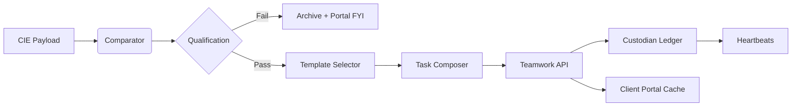

# Teamwork Reflex Pipelines (Competitive Intelligence Engine)

## Purpose
Translate Competitor Intelligence Events (CIEs) into actionable Teamwork tasks without human rewrites, preserving Charter-standard governance and ensuring Reflex closes the loop from detection → assignment → completion.

## Event Lifecycle
1. **Agent Output** – CIE payload emitted with detected change + confidence.  
2. **Comparator & Scoring** – Adds impact ratings (threat, opportunity, urgency, revenue).  
3. **Qualification** – Pipeline admits events where `confidence ≥ 0.65` **and** (`threat ≥ Medium` **or** `opportunity ≥ Medium`).  
4. **Template Selection** – Match on `delta_type` + `channel`.  
5. **Task Composition** – Populate Teamwork fields, attach evidence, set SLA, embed Custodian hash.  
6. **Dispatch** – Call Teamwork API. Store `task_id` back in MAOS + Custodian log.  
7. **Feedback** – Task updates/closures feed Heartbeats + Portal risk downgrades.

Mermaid overview:

## Template Library
| Template ID | Trigger | Task Title Pattern | Checklist Highlights | Default Squad | SLA | Escalation |
| --- | --- | --- | --- | --- | --- | --- |
| `new_sku_launch` | `channel=product` + `delta=SKU` | `Verify implications of {competitor} {sku}` | Confirm feature parity, messaging update, enablement brief. | Product Strategy | 48h | Escalate to Strategy Sprint if unresolved. |
| `price_move` | `channel=pricing` + % change | `Counter-plan: {competitor} price change` | Pricing grid update, retention messaging, promo options. | Revenue Ops | 24h | Notify C-suite on ≥10% delta. |
| `campaign_launch` | `channel=ads` | `Respond to {competitor} {channel} campaign` | Creative teardown, retarget list, budget recommendation. | Paid Media | 24h | Auto-tag Exec sponsor if spend tier = “High”. |
| `keyword_defense` | `channel=ads` + keyword overlap | `Defend keywords vs {competitor}` | SERP check, ad copy refresh, landing page audit. | Growth Marketing | 12h | Auto-page search lead if CPC spike >15%. |
| `sentiment_risk` | `channel=social` + negative spike | `Address sentiment risk caused by {competitor/event}` | Narrative response, customer comms, CS alignment. | Comms + CX | 6h | Red alert if spike >40%. |
| `feature_gap` | `channel=docs` + classified as Feature | `Close feature gap vs {competitor}` | Gap analysis, roadmap impact, enablement messaging. | Product + Eng | 72h | Strategy sprint review on repeated hits. |

Templates live in Codex, versioned; Reflex references template hash each run.

## Task Composition Mapping
| Teamwork Field | Source |
| --- | --- |
| `project_id` | From Definition Map (`teamwork_project_id`). |
| `content` | Template title + auto summary (3 sentences) referencing Charter brief sections. |
| `description` | Full Charter-standard write-up with Summary, Market Impact, Strategic Implication, Recommended Actions, Governance Notes. |
| `tags` | `[MAOS, CompetitorIntel, {client_id}, {delta_type}]`. |
| `assignees` | Squad default + custodian (if review required). |
| `start_date` | Event timestamp. |
| `due_date` | `start_date + SLA` (hours). |
| `priority` | Map threat score to Teamwork priority. |
| `custom_fields` | `custodian_hash`, `confidence`, `impact_scores`, `evidence_uri`. |

## Governance Touchpoints
- **Custodian Approval**: If template flagged `requires_review`, Reflex pauses dispatch until Custodian toggles approval in Codex (max 6h SLA).  
- **Custodian Hash**: Provided in custom field + description footer for audit.  
- **Task Linking**: Reflex posts `task_id` back to MAOS to prevent duplicate tasks for the same event.  
- **Escalation**: Heartbeats monitor for tasks overdue by >25% of SLA; automatically generate `Reflex Escalation` task.

## Feedback Hooks
| Event | Action |
| --- | --- |
| Task completed | Portal risk downgraded, KPI impact recalculated. |
| Task reopened | Reflex spawns follow-up subtask referencing original event. |
| Task deleted | Log anomaly; Custodian approval required. |

## Testing
- Use sandbox Teamwork project to run template smoke tests per delta type.  
- Snapshot diff of composed tasks vs expected golden files.  
- SLA simulations verifying due date + escalation times.

This pipeline ensures the Competitive Intelligence Engine never stops at observation—every validated competitor move becomes a governed Teamwork action.
